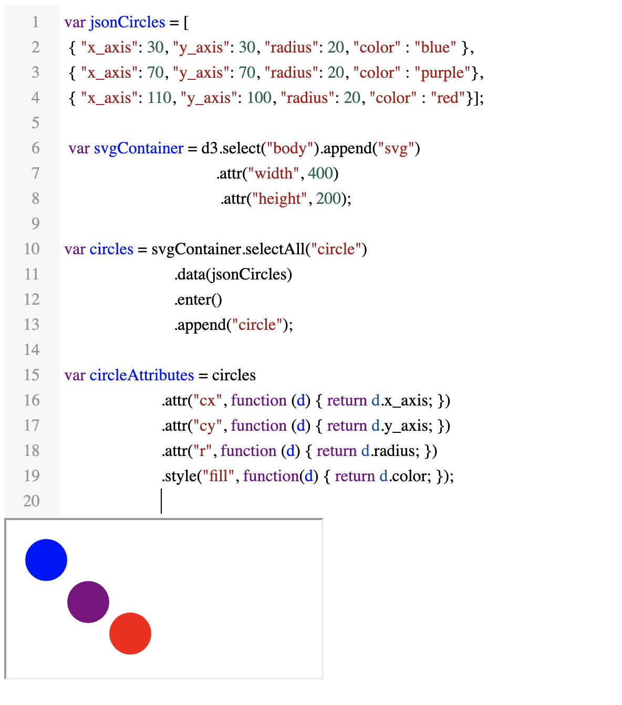

# Browser REPL JS

The idea is to have a code editor where you can put in code or there is code prefilled and you see the result of the code and can edit the code.  

## Motivation

I give plenty of workshops with d3 and I used Codebin or similar tools in the past, but they have their downsides. There are not integrated with your website and take long to load. Sometime with these workshops the internet connection is not good, and I need an offline alternative.  
I tried observable which is great for d3 and you can for the code and try it out yourself. But ypu need to learn the observable way before you can learn d3 and it only works with internet. 

That's why I built the prototype in a day to test it out. 

### Example how it looks like

